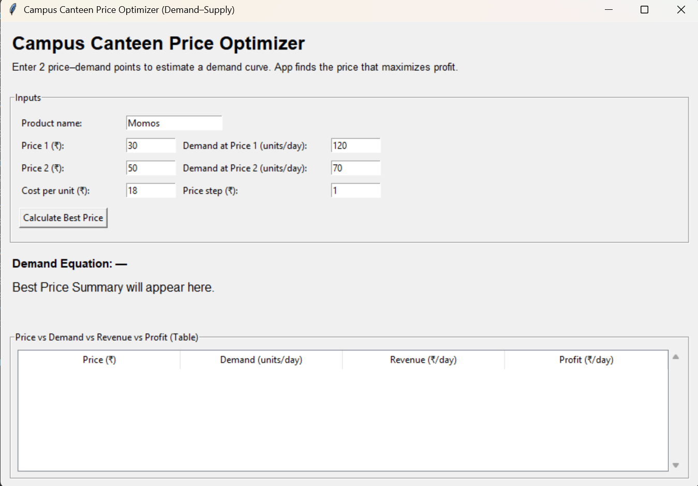
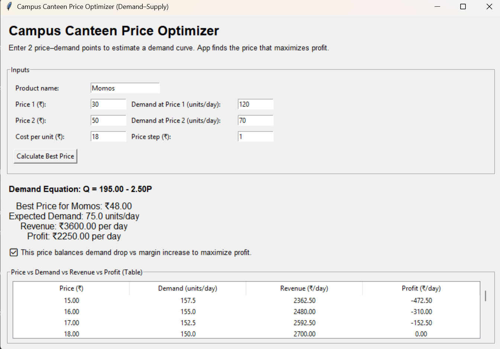

# Campus Canteen Price Optimizer

This is a simple tool I built to determine the best selling price for a product in a campus canteen.

Instead of guessing prices, it uses demand and cost data to calculate the price that maximizes profit.

## Why this project?
Pricing is often based on assumptions. This tool shows how basic economics and programming can be used to make better, data-driven decisions.

## Features
- GUI built using Tkinter  
- Calculates demand equation from given data  
- Displays revenue and profit for different price points  
- Suggests the optimal price for maximum profit  

## How to run
1. Install Python  
2. Run:  
   python price_optimizer.py  

## Output Preview

The user enters price and demand values, and the system calculates the optimal price along with revenue and profit.

### Input Screen

### Output Screen

## Future Improvements
- Add graph visualization for demand vs price  
- Support CSV input for real-world data  
- Improve UI design  
